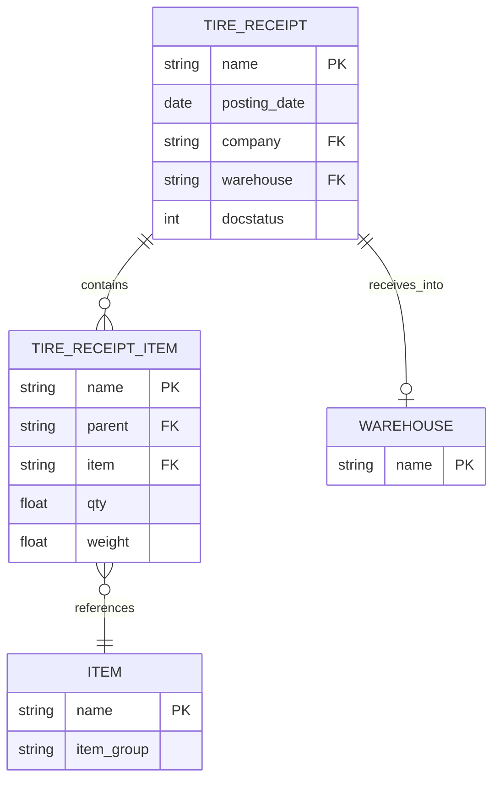

# erpnext-factory-ops

```mermaid
erDiagram
    TIRE_RECEIPT {
        string name PK
        date posting_date
        string company FK
        string warehouse FK
        int docstatus
    }
    TIRE_RECEIPT_ITEM {
        string name PK
        string parent FK
        string item FK
        float qty
        float weight
    }
    ITEM {
        string name PK
        string item_group
    }
    WAREHOUSE {
        string name PK
    }

    TIRE_RECEIPT ||--o{ TIRE_RECEIPT_ITEM : contains
    TIRE_RECEIPT_ITEM }o--|| ITEM : references
    TIRE_RECEIPT ||--o| WAREHOUSE : receives_into
```

